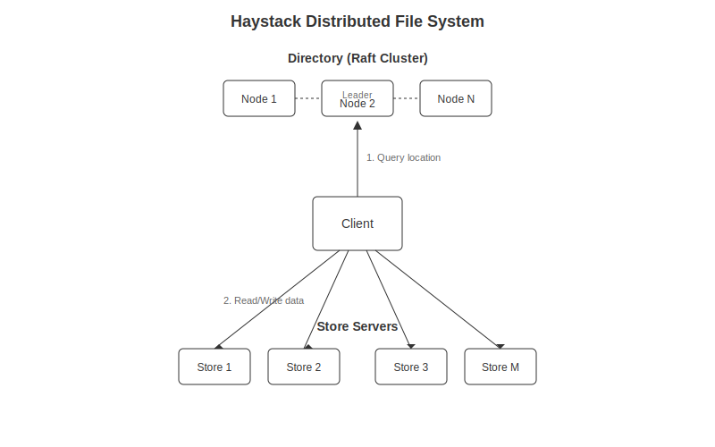

# haystack: a distributed file system for small files

A distributed file system optimized for small files. The design is inspired by Facebook's Haystack filesystem which was meant for images.

## Architecture:

The architecture contains a directory which is raft cluster for added availability. The client asks the directory where a given ID should be written to. Then the client can write the given file to a logical volume as chosen by the directory.



### Logical volumes

Logical volumes are large append-only files that contain many smaller files. The store keeps an index for each logical volume for each file and their offsets and lengths. The format is such that the index can be recovered on startup.

```
format on file:
| uuid 16 bytes | length 8 bytes | length bytes for content |
```

The directory takes care of managing logical volumes such that they don't get too large. Due to the index and the append-only nature the reads are very fast.

## TODO:

All basic functionality is already implemented

[ ] Implment a cache for files.
[ ] Security
