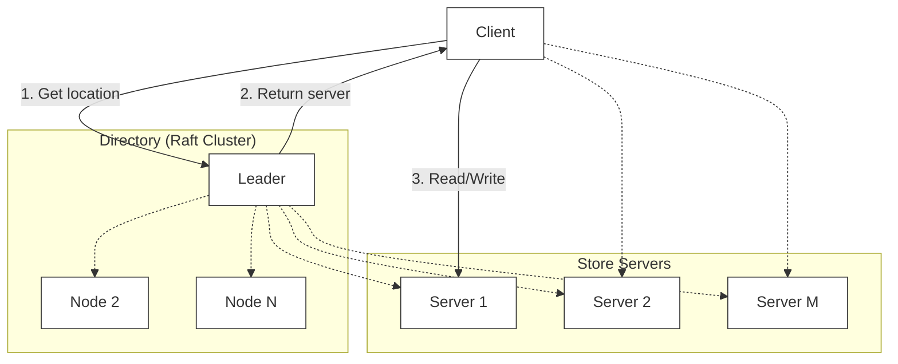

# haystack: a distributed file system for small files

## Architecture:

```mermaid
graph TB
    Client[Client]
    
    subgraph Directory["Directory (Raft Cluster)"]
        Leader[Leader]
        F1[Node 2]
        F2[Node N]
        Leader -.-> F1
        Leader -.-> F2
    end
    
    subgraph Stores["Store Servers"]
        S1[Server 1]
        S2[Server 2]
        SM[Server M]
    end
    
    Client -->|"1. Get location"| Leader
    Leader -->|"2. Return server"| Client
    Client -->|"3. Read/Write"| S1
    Client -.-> S2
    Client -.-> SM
    
    Leader -.-> S1
    Leader -.-> S2
    Leader -.-> SM
    
    classDef client fill:#ffffff,stroke:#333333
    classDef directory fill:#ffffff,stroke:#333333
    classDef store fill:#ffffff,stroke:#333333
    
    class Client client
    class Leader,F1,F2 directory
    class S1,S2,SM store
```
